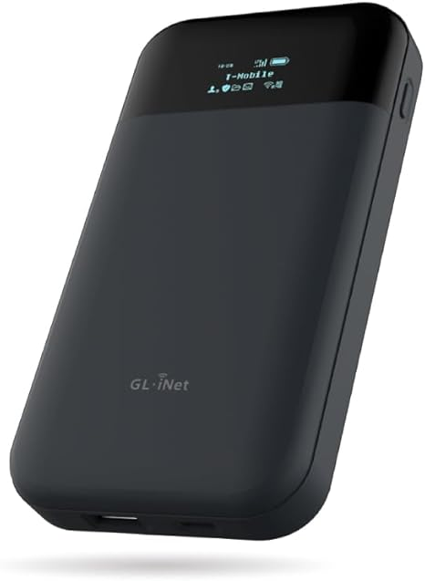
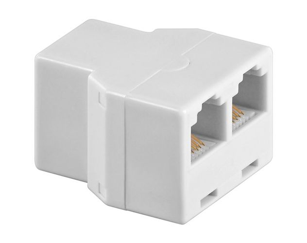
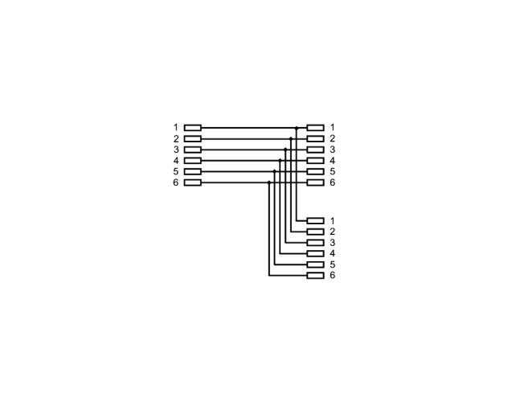
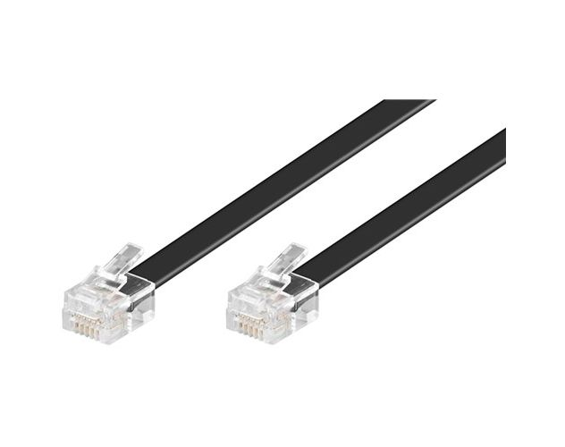
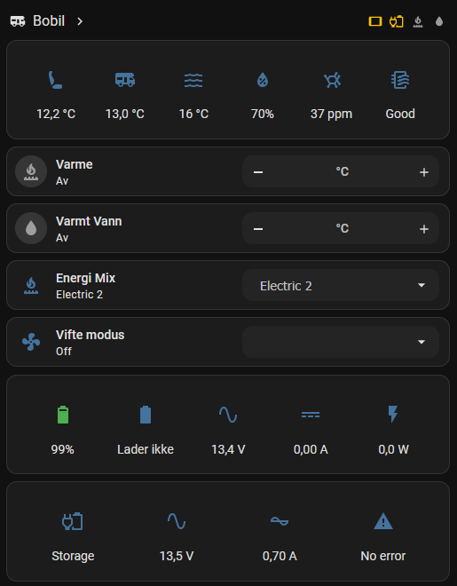

# Readme

This repository documents my ESPHome-based integration for a Truma Combi 6E setup in my RV.

ESPHome YAML file: [esphome-supermini.yml](esphome-supermini.yml)

The configuration is based on https://github.com/havanti/esphome-truma and adapted for an ESP32-C6 SuperMini with a UART-to-LIN interface.

## Wiring Diagram

[esphome-truma-wiring.drawio](esphome-truma-wiring.drawio)

| PIN to PIN | Wire |
| --- | --- |
Vehicle 12V Supply <-> DC/DC Converter USB-C | Red(12V) and Black(GND) wire 
DC/DC Converter USB-C <-> Wifi Router | USB-C to USB-C Cable 
Wifi Router <-> ESP32 USB-C | USB-A to USB-C Cable 
DC/DC Converter - (Black) <-> LIN BUS GND | Black wire (screw)
DC/DC Converter + (Red) <-> LIN BUS 12V | Red wire (screw)
RV Power (Black) <-> LIN BUS GND | Black wire (screw)
RV Power (Red) <-> LIN BUS 12V | Red wire (screw)
Truma RJ12 PIN4 <-> LIN BUS LIN | Yellow wire (screw)
ESP32 GPIO-7 (TX) <-> LIN BUS RX | Blue wire (soldered on ESP32)
LIN BUS TX <-> R1 (10 kΩ series) <-> ESP32 GPIO-6 (RX) | Green wire (soldered on ESP32), via 10 kΩ
ESP32 GPIO-6 (RX) <-> R2 (20 kΩ) <-> ESP32 GND | Voltage-divider lower leg (20 kΩ to GND)
ESP32 GND <-> LIN BUS GND | Black wire (soldered on ESP32)

> **⚠️ Level shifting required on LIN BUS TX → GPIO-6.**
> The UART-to-LIN module's TX output is **5 V** logic (TJA1021/SIT1021T, no VIO pin), but the ESP32-C6 GPIOs are **3.3 V and not 5 V tolerant** (abs. max ~3.6 V). Driving GPIO-6 directly with 5 V will damage the pin over time (it killed RX on my first build after ~1 week).
> A resistor divider on the green wire brings it down: **LIN TX → 10 kΩ (R1) → GPIO-6**, and **GPIO-6 → 20 kΩ (R2) → GND**, giving ≈ 3.0–3.3 V at GPIO-6 (idle measured ~2.45–2.90 V with bus traffic). The 10 kΩ/20 kΩ values keep the load light enough for the module's weak TX to pull the line high. The ESP TX → module RX direction (blue wire) needs no shifting — the module accepts 3.3 V input.

## Hardware

| Device | Shop | Picture |
| --- | --- | --- |
GL.iNet GL-E750V2 (MUDI) 4G LTE Portable Wi-Fi Hotspot for Travel | [Amazon](https://www.amazon.com/GL-iNet-GL-E750V2-OpenWrt-T-Mobile-WireGuard/dp/B0CJF7KQ3Q) | 
ISDN T-Adapter RJ12 female (6P6C) | [BatteriOnline](https://www.batterionline.no/kabler-tilslutning/datakabler/internett-pc-stromkabler/isdn/isdn-t-adapter-rj12-hun-6p6c-1-pcs) |  
RJ12 Cable 2x RJ12 male (6P6C) | [BatteriOnline](https://www.batterionline.no/kabler-tilslutning/diverse-kabler/telefonledninger/skjoteledning-6p6c/telefon-forlengerkabel-2x-rj12-han-6p6c-3m) | 
UART to LIN Bus Module | [AliExpress](https://www.aliexpress.com/item/1005008499687135.html) | 
ESP32-C6 SuperMini | [AliExpress](https://www.aliexpress.com/item/1005007676682081.html) | 
12V/24V DC-DC Step Down Module USB-C | [AliExpress](https://www.aliexpress.com/item/1005007820939213.html) | 
RJ12 6P6C Female Plug-In Terminal Connector | [AliExpress](https://www.aliexpress.com/item/1005009539648208.html) | 
Resistors 10 kΩ + 20 kΩ (¼ W) for LIN TX → GPIO-6 level divider | Any electronics kit | —

## Home Assistant Dashboard

The Home Assistant dashboard displays Truma room and water temperature sensors, along with an additional sensor for temperature, humidity, TVOC, and air quality at the top. Below this, the Truma controls are simplified to include only the functions I use most frequently. Using the Bluetooth proxy function of ESPHome, the dashboard also pulls in sensor data from a Skanbatt lithium battery and a Victron charger.

